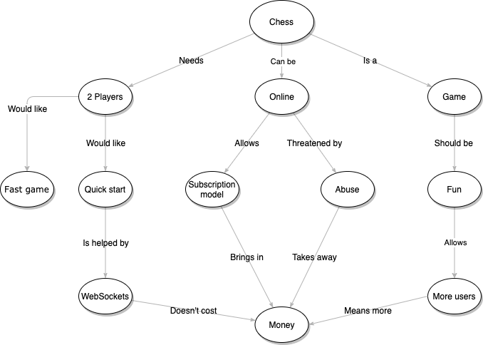

# Chess Online
This is the application for an online chess game that has a stable multiplayer experience.

## Plan

Developed:

 - ~~Game (chessboard-js and chess.js hopefully will cover this)~~
   + ~~Setup (Who's playing, what side) (Chess.js)~~
   + ~~Turns (Chess.js)~~
     + ~~Moving pieces (Chess.js)~~
       + ~~Pawn~~
       + ~~Knight~~
       + ~~Bishop~~
       + ~~Rook~~
       + ~~Queen~~
       + ~~King~~
     + ~~Taking pieces (Chess.js)~~
     + ~~Replacing (when Pawn gets to the end) (Chess.js)~~
     + ~~Animation (Chessboard.js)~~
   + ~~Win scenarios~~
   + ~~Loss scenarios~~

Need to develop:

   + Score calculation
   + Chat
     + Message
     + Video
   + Administration
     + Banning
 - Lobby system (need ideas on lobby framework)
   + Share invitation code
   + Matching function (ranking?)

## Concept map

